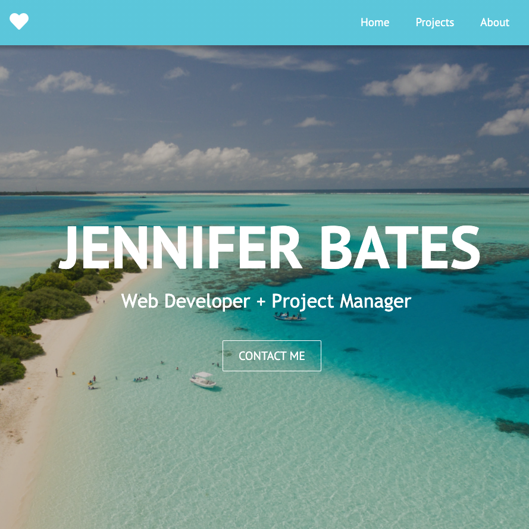

              

# React Portfolio

A web developer portfolio using React to create UI components, manage component state and respond to user click events. 

## Project Links
[Repo Link](https://github.com/onomatopoetica/react-jen-portfolio)  
**NOTE:** The deployed portfolio can be found on [GitHub Pages](https://onomatopoetica.github.io/react-jen-portfolio/). Please see the [Getting Started](#Getting-Started) section for more information regarding installation, usage and where to go for questions.
    
## Table of Contents
1. [About The Project](#About-The-Project)
1. [Project Links](#Project-Links)
1. [Demo](#Demo)
1. [Getting Started](#Getting-Started)
1. [Installation](#Installation)
1. [Usage](#Usage)
1. [Questions](#Questions)
1. [Project Status](#Project-Status)
1. [License](#License)

## About The Project

The scope of this project was to create my portfolio using React. 

When the portfolio loads, a user can:

* View an `About Me`, `Project` and `Contact Me` section,

* View six project cards with links to each project repository and live application page,

* Click through to my social media accounts, 

* Download a copy of my resume.

## Demo

#### The following is an overview and rendering of the portfolio in operation. 
    
  

#### The following is a screenshot of the portfolio and overview of its functionality:  

 

## Getting Started
    
#### Technologies used in this project include:
* React
* Node
* GH-Pages
    
## Installation: 
 
#### Clone Repository

* `git clone https://github.com/onomatopoetica/react-jen-portfolio.git`

#### Install Dependencies 

* Ensure you have [Node.js](https://nodejs.org) installed on your machine. 

* `npx create-react-app react-jen-portfolio` to install React for the project.

* All NPM packages required for this application are already listed as dependencies in the `package.json` file. Run the command `npm install` command in your terminal at the root directory level to install the packages.

#### Deploying To GitHub Pages

* Click here for instructions on deploying to [GitHub Pages](https://create-react-app.dev/docs/deployment/).

#### Start Application

* Once React and dependencies are installed, cd into your directory (if not already there) and run `npm start` to view the project on http://localhost:3000/.
 

### _Return to [Table of Contents](#Table-of-Contents)_
 
  
## Usage 

* See [About The Project](#About-The-Project) or [Demo](#Demo) video above for more information on how it works.

## Questions 
#### Connect With Me:  

#### [Onomatopoetica](https://github.com/onomatopoetica)  
   

    
Contact

    jendotb@gmail.com

## Project Status

    
Current Project Activity

    Active

 

### _Return to [Table of Contents](#Table-of-Contents)_
 
    
## License
#### Distributed under the MIT License. See `LICENSE` for more information.

##### This README was generated with :hearts:&nbsp; by [Good README Generator](https://github.com/onomatopoetica/Good-README-Generator).
